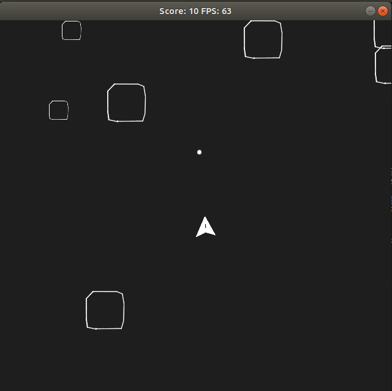

# Asteroids clone - CPPND: Capstone

## About

A clone of the popular Atari asteroids game built using C++ and SDL2.

## Overview

Once a user builds the application per the below build instructions a new window is created which features a ship that can fire projectiles, and asteroids. A player uses the W,A,S,D keys to move the ship around and the space bar to fire at Asteroids. Destroying large asteroids increases the players score by 5 points, and destroying small asteroids increases the score by 5 points. The game stops when an asteroid collides with the ship or the player quits the application. The console will reflect if the ship has collided with an asteroid and will reflect a player's final score. The title bar for the game window generated reflects the in game score and frames per second.

### Game controls

Keyboard keys

- W - Apply thrust/Move ship forward in a given direction
- A - Turn ship right
- S - Apply thrus/Move ship backwards in a given direction
- D - Turn ship left
- Space - Press and hold for 2-3 secs and release to fire a projectile

## Dependencies for Running Locally

- cmake >= 3.7
  - All OSes: [click here for installation instructions](https://cmake.org/install/)
- make >= 4.1 (Linux, Mac), 3.81 (Windows)
  - Linux: make is installed by default on most Linux distros
  - Mac: [install Xcode command line tools to get make](https://developer.apple.com/xcode/features/)
  - Windows: [Click here for installation instructions](http://gnuwin32.sourceforge.net/packages/make.htm)
- SDL2 >= 2.0
  - All installation instructions can be found [here](https://wiki.libsdl.org/Installation)
  - Note that for Linux, an `apt` or `apt-get` installation is preferred to building from source.
- SDL2_image >= 2.0
  - All installation instructions can be found [here](https://www.libsdl.org/projects/SDL_image/)
  - Note for Linux use `apt-get install libsdl2-image-dev`
- gcc/g++ >= 5.4
  - Linux: gcc / g++ is installed by default on most Linux distros
  - Mac: same deal as make - [install Xcode command line tools](https://developer.apple.com/xcode/features/)
  - Windows: recommend using [MinGW](http://www.mingw.org/)

## Basic Build Instructions

1. Clone this repo.
2. Make a build directory in the top level directory: `mkdir build && cd build`
3. Compile: `cmake .. && make`
4. Run it: `./Asteroids`.

## Architecture and Code Organization

The architecture for this application was based on the architecture used in the CppND Snake Game example code and numerous online tutorials, videos, forums and resources.

The application code hierarchy is as follows:

The main function declares and initializes several constants for frame rate calculations, window and grid sizing for the created window. Within main objects of the renderer, controller and game classes are created and instantiated. The run method is called on the created game object and finally when the user quits the game a successful quit message and the user's final score is displayed in the console.

The renderer class initializes SDL, creates a renderer, window and loads textures from external file paths for images of the ship,asteroids and projectiles. Next the renderer class destroyer is implemented to destroy the window and quit SDL. The render method renders the ship, projectiles, and large and small asteroids to the window in separate SDL rectangles which are sized and scaled based on the screen width, height, grid width and height. The rectangles are positioned based on position data calculated in classes defining the ship, projectile and asteroids. Lastly the update window title is used to render the window title with the score and frames per second.

A texture manager helper class was created and used to abstract away loading and creating textures from image file paths.

The controller class defines the different actions that will occur based on user keyboard input. For example, what direction will the ship move in and firing a projectile. This classes uses the SDL PollEvent loop, with two switch statements based on keyboard inputs being pressed down or released. If the W,A,S,D keys are pressed for example the ship moves as described above, if they are released the ship stops, similarly the space key being pressed fires a projectile and releasing the key stops firing.

A GameObject base class is defined which is used to define the ship, projectile and asteroid game objects. This class defines properties these three objects will have in common such as x and y position, width and height and an update method that is overriden in the ship and projectile classes. The update method is meant for control of the ship or projectile.

The Ship class sets the position, width and height of the ship game object the user controls throughout the game. These properties are then utilized in the render class to accurately render the ship to the screen based on it's changing position. The overriden update method invokes a private control ship method which uses an enum, switch statement and formulas to change the ships position and velocity. The switch statement defaults the ship to a neutral or stopped position, the up case case moves the ship forward in the direction it is facing, the down case moves the ship backwards in the opposite direction, the left and right cases change the ships angle of rotation to move the ship in a circle left or right. Circular motion, speed and elapsed time are used to calculate the ship's forward and backward velocity. In the controller class these cases are attached to the W,A,S, and D keys based on their respective directions.

A similar approach is followed for the projectile class. The projectile's start position is the ship's position and it's height and width are based on the ships width and height. The overriden update method from the game object class invokes a control projectile method which is set-up similar to the private control ship method. An enum with two cases is used in a switch statement to control the firing of projectiles, with the default being set to not fire. Circular motion, speed and elapsed time are used to calculate the projectile's forward velocity. In the controller class these cases are attached to the space key based on their respective action.

The game class is where the asteroid game objects and their properties are defined. The run method in this class defines the game loop and is invoked in main. The game loop calculates frame rates based on duration between start and end frames and the input frame rate parameters from the main function. The place asteroids method creates pointers to asteroid objects of the game object class and sets the properties for the asteroid objects. In the method a new created asteroid's x and y position is checked to see if it will not interfere with the ship's location, if there is no interference the x and y position for th asteroid are set. The asteroid's position is random if it is large asteroid or if it is a small asteroid it is based on the last position of a large asteroid. The large asteroids are stored in a vector of shared pointers to GameObjects and the small asteroids are stored in another vector of shared pointers. The Asteroids method iterates through a asteroid vector, sets an asteroids velocity using the same equations used for the ship and projectile's velocity, and checks if the asteroid will collide with the ship again as it is moving now. Next the asteroid's position is checked with a projectile's position to see if a fired projectile has hit an asteroid. If a hit has occurred the asteroid is removed from the vector. The score is incremented according to an asteroid being a small or large asteroid. A check collision method is implemented and invoked in the above mentioned methods. This method uses bounding box collision testing to test if two rectangles will collide. Lastly the Asteroids methods are invoked using parameters for large and small asteroids in the update method within the game class. Next the size of the large asteroids vector is checked against the size of the small asteroids vector to see if more large asteroids need to be spawned. The ship and projectile update methods defined from their respective classes are invoked next.

## Known Issues/Ideas for future features

Collision dection sometimes can indicate your ship has collided with an asteroid when the ship is very close but not touching the asteroid, this is due to the simple bounding box collsion detection used a more advanced collision detection could solve this

Sometimes smaller asteroids do not spawn directly where the larger asteroid was destroyed

Features could be added to allow for text on the screen when the game is over, possibly indicating the player's final score

More lives for the player to keep playing

## Build Status

Last build, tested and passing on 11 August 2019

## CppND Rubric

The project demonstrates an understanding of C++ functions and control structures.

- The game, controller, ship and projectile classes demonstrate this

The project reads data from a file and process the data, or the program writes data to a file.

- The texture manager class and Renderer class demonstrate this

The project uses Object Oriented Programming techniques.

- The game object, ship and projectile classes demonstrate this

Classes use appropriate access specifiers for class members.

- All class definitions use access specifiers for class members

Class constructors utilize member initialization lists.

- Member initialization lists are used the game class, renderer class, ship and projectile classes

Classes abstract implementation details from their interfaces.

- Class members through the code base are documented and accurate function and variable names are used

Classes encapsulate behavior.

- All classes in the codebase group appropriate member functions and variables together

Classes follow an appropriate inheritance hierarchy.

- The game object, ship and projectile classes follow an inheritance hierarchy, with the ship and projectile classes inheriting from the game object class and overriding the update method from the game object base class.

Derived class functions override virtual base class functions.

- The ship and projectile classes inherit from the game object class and override the update method from the game object base class.

The project uses destructors appropriately.

- The renderer class uses a destructor to destroy the window upon exiting the program

The project uses smart pointers instead of raw pointers.

- The asteroid vectors are vectors of shared pointers to game object instances.
